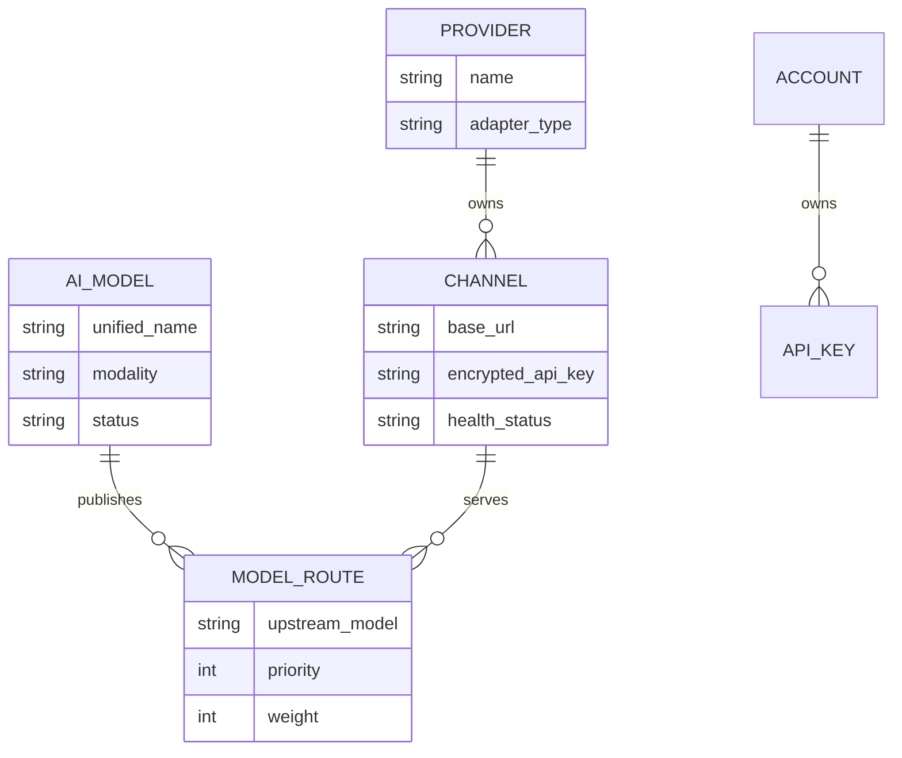

# Token Router

[English](README.md) | [简体中文](README.zh-CN.md)

Token Router is an internal AI model aggregation and distribution gateway. It exposes stable OpenAI-compatible APIs over multiple upstream providers and gives organizations a control plane for model publication, routing, access control, quotas, health management, and auditing.

It is designed for internal platform governance—not API resale. Pricing, balances, payments, subscriptions, redemption codes, public registration, and project-based billing are intentionally out of scope.

## Highlights

- OpenAI-compatible `models`, `chat/completions`, `responses`, and `embeddings` endpoints.
- Normal JSON and SSE streaming responses, including tool-call passthrough.
- Explicit gateway-model-to-upstream-model mapping.
- Priority and weighted routing, retries, failover, cooldown, and half-open recovery.
- User-owned `tr_` API keys with model scopes, expiration, IP/CIDR allowlists, RPM, TPM, concurrency, token, and request limits.
- Transactional quota reservation and idempotent usage settlement.
- OIDC control-plane authentication and automatic administrator assignment through `adminEmails`.
- Provider, channel, model, route, user quota, usage, route-attempt, and audit management.
- Channel testing, upstream model discovery, safe model import, and administrator-only model diagnostics.
- Separate personal and system console navigation. Administrators remain regular users and enter the system console from the top-right user menu.
- A Codex-inspired model chat workspace with private conversation history, automatic titles, search, and deletion.
- Chinese and English console localization using the standard Ant Design Pro layout.

## Core Domain Model

The provider, channel, and model concepts are deliberately separate:



- **Provider** defines a vendor or adapter type, such as an OpenAI-compatible provider.
- **Channel** is a concrete provider connection with a base URL, credential, routing defaults, and health state. One provider can have multiple channels.
- **AI Model** is the stable, unified model name published to internal users.
- **Model Route** maps one unified model to an upstream model on a channel. A model can use multiple channels for failover and weighted distribution.

The usual configuration order is: **Provider → Channel → Model → Route**.

## Architecture

```text
Browser / OIDC user
        │
        ├── /api/v1/* ── Control plane ── Models, routes, quotas, logs, audits
        │
Internal application / OIDC token or tr_ API key
        │
        └── /v1/* ───── Data plane ───── Authentication → admission → routing
                                                   → upstream → settlement
```

- The **control plane** uses an enterprise OIDC identity.
- The **data plane** accepts OIDC bearer tokens and user-created `tr_` API keys. OIDC calls use
  account-level quotas; API-key calls use both account and key-level quotas.
- `oidcConfig.skipClientIDCheck` controls whether JWT `aud` must contain this service's
  `clientId`. When enabled, tokens issued to different clients by the same trusted issuer are accepted.
- Usage logs and route attempts do not persist request or response bodies.
- Upstream API keys are encrypted at rest with AES-GCM.

## Console Roles

All authenticated users can access:

- My Dashboard
- Model Chat
- API Keys

Administrators have the same personal capabilities. They enter the separate system console through **System Console** in the top-right user menu. The personal and system menu trees are never mixed. In the system console, administrators can switch back through **Personal Console**.

An OIDC user receives the `admin` role when their email matches an entry in `adminEmails`. Matching ignores surrounding whitespace and letter case.

## Repository Layout

```text
token-router/
├── backend/     Go API server, migrations, routing, quota, and code generator
├── frontend/    React 19 and Ant Design Pro 6 console
└── docs/        Product and technical specifications
```

## Requirements

- Go 1.26.4
- Node.js 22 or later
- npm
- MySQL for the supplied configuration, or SQLite when the `mysql` block is omitted
- An OIDC provider for console login
- At least one OpenAI-compatible upstream for model traffic

## Local Development

### 1. Configure the backend

Edit `backend/config/config.yaml`. Do not commit production credentials. The minimum areas are database, OIDC, gateway secret, and administrator emails:

```yaml
mysql:
  host: localhost:3306
  user: token_router
  password: replace-me
  dbname: token_router

oidcConfig:
  issuer: https://identity.example.com
  clientId: token-router
  clientSecret: replace-me

gateway:
  # Base64 encoding of exactly 32 random bytes.
  secretKey: replace-me

adminEmails:
  - platform-admin@example.com
```

Generate a development gateway key with:

```shell
openssl rand -base64 32
```

The following environment variables override the corresponding sensitive configuration values:

- `TOKEN_ROUTER_OIDC_ISSUER`
- `TOKEN_ROUTER_OIDC_CLIENT_ID`
- `TOKEN_ROUTER_OIDC_CLIENT_SECRET`
- `TOKEN_ROUTER_GATEWAY_SECRET_KEY`
- `TOKEN_ROUTER_CHAT_SKILL_DIRECTORIES`
- `TOKEN_ROUTER_CHAT_MCP_CONFIG_FILE`

The container image supports Skills, Streamable HTTP MCP, and Node/Python stdio MCP while running
as a non-root user. See [Skills and MCP in containers](docs/deployment/container-capabilities.md) for
mount paths, Secret handling, and Docker Compose/Kubernetes examples.

Register this browser callback URL with the OIDC provider:

```text
http://localhost:8001/oauth/callback
```

### 2. Start the backend

Database migrations run automatically at startup.

```shell
cd backend
go run ./cmd/start.go -c ./config/config.yaml
```

The API server listens on `http://localhost:9006`.

To run migrations without starting the server:

```shell
cd backend
go run ./cmd/bootstrap --config ./config/config.yaml --migrate-only
```

### 3. Start the frontend

```shell
cd frontend
npm install
npm run dev
```

Open `http://localhost:8001`. During development, `/api` and `/v1` are proxied to `http://localhost:9006`. Override the target when needed:

```shell
API_PROXY_TARGET=http://localhost:9006 npm run dev
```

### 4. Optional upstream bootstrap

The bootstrap command creates a local administrator, provider, channel, unified model, route, and one-time test token. The upstream key is read from an environment variable and is not written to configuration files.

```shell
cd backend
UPSTREAM_API_KEY='replace-me' go run ./cmd/bootstrap \
  --config ./config/config.yaml \
  --base-url 'https://upstream.example.com/v1' \
  --model 'internal-model-name' \
  --upstream-model 'provider-model-name'
```

## Data Plane Examples

Set the user-created API key returned by the console:

```shell
export TOKEN_ROUTER_API_KEY='tr_replace_me'
```

List published models:

```shell
curl http://localhost:9006/v1/models \
  -H "Authorization: Bearer ${TOKEN_ROUTER_API_KEY}"
```

Create a chat completion:

```shell
curl http://localhost:9006/v1/chat/completions \
  -H "Authorization: Bearer ${TOKEN_ROUTER_API_KEY}" \
  -H 'Content-Type: application/json' \
  -d '{
    "model": "internal-model-name",
    "messages": [{"role": "user", "content": "Hello"}]
  }'
```

Create a response:

```shell
curl http://localhost:9006/v1/responses \
  -H "Authorization: Bearer ${TOKEN_ROUTER_API_KEY}" \
  -H 'Content-Type: application/json' \
  -d '{
    "model": "internal-model-name",
    "input": "Summarize the purpose of an AI gateway."
  }'
```

Background Responses API tasks are not supported in the first version; `background: true` is rejected explicitly.

## Health Endpoints

- `GET /livez` checks whether the process is alive.
- `GET /readyz` checks the database, required schema, and gateway encryption key.
- External providers are intentionally excluded from readiness to prevent restart loops during upstream outages.

## Development Commands

Backend checks:

```shell
cd backend
go test ./...
```

Frontend checks and build:

```shell
cd frontend
npm run lint
npm run build
```

Regenerate the frontend API client after changing backend DTOs or routes:

```shell
cd backend
GOFLAGS=-mod=mod go run ./generate
```

Generated files are written directly to `frontend/src/services` and should not be edited manually.

## Documentation

Start with the [specification index](docs/spec.md). Detailed documents cover product scope, domain entities, security, control-plane APIs, data-plane routing, quotas, console behavior, dashboards, delivery criteria, and the enterprise capability roadmap.

## Current Scope

The first adapter targets OpenAI-compatible upstreams. Native Anthropic Messages and Gemini adapters, pluggable content-safety policies, distributed circuit state, OpenTelemetry export, and alert delivery are planned extensions. Commercial billing features remain out of scope.
