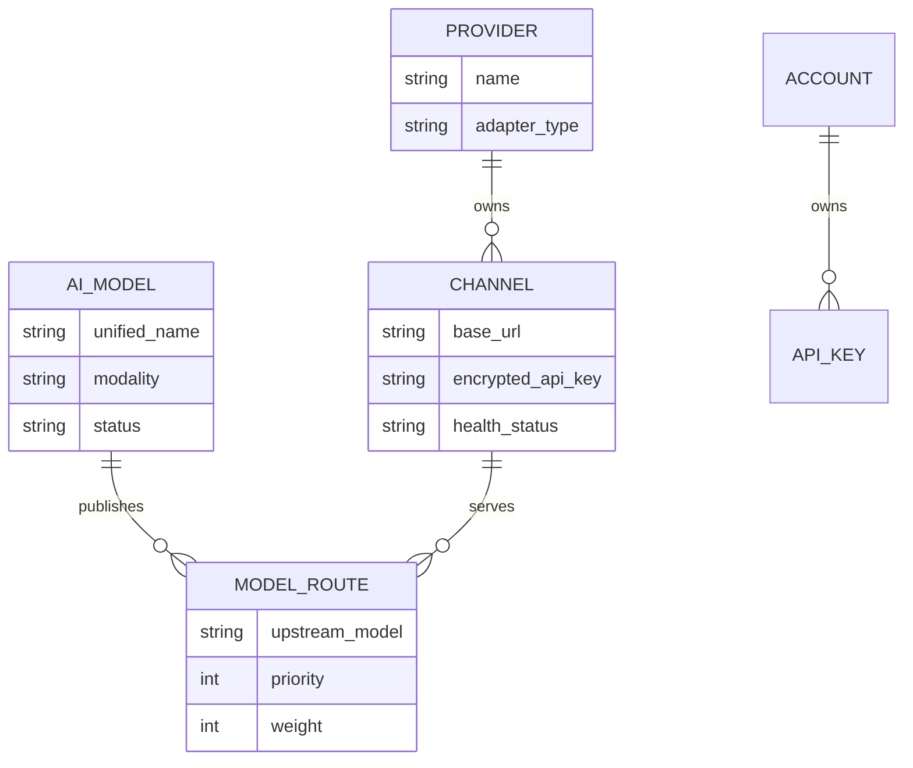

# Token Router

[English](README.md) | [简体中文](README.zh-CN.md)

Token Router 是面向企业内部的统一 AI 模型聚合与分发网关。它将多个上游供应商收敛为稳定的 OpenAI 兼容 API，并提供模型发布、路由、访问控制、限额、健康管理和审计控制面。

本项目服务于企业内部平台治理，不是 API 商业售卖平台。价格、余额、充值、支付、订阅、兑换码、公开注册和项目计费均明确排除。

## 主要能力

- 提供 OpenAI 兼容的 `models`、`chat/completions`、`responses` 和 `embeddings` 接口。
- 支持普通 JSON、SSE 流式响应和工具调用透传。
- 统一模型名到上游模型名的显式映射。
- 支持优先级、权重、重试、故障切换、冷却和半开恢复。
- 用户自有 `tr_` API Key，支持模型范围、过期时间、IP/CIDR 白名单、RPM、TPM、并发、Token 总量和请求次数限制。
- 事务化限额预留和幂等用量结算。
- 控制面使用 OIDC 登录，并通过 `adminEmails` 自动授予系统管理员角色。
- 提供供应商、渠道、模型、路由、用户额度、用量、路由尝试和操作审计管理。
- 支持渠道测试、上游模型发现、安全导入和仅管理员可用的模型演练诊断。
- 个人控制台与系统控制台分区。系统管理员仍是普通用户，通过右上角用户菜单进入系统控制台。
- Codex 风格的模型对话工作区，支持当前用户私有的会话历史、自动标题、搜索和删除。
- 控制台基于 Ant Design Pro 原生布局，支持中英文切换。

## 核心领域关系

供应商、渠道和模型是刻意拆分的概念：



- **供应商（Provider）**：定义厂商或适配器类型，例如 OpenAI Compatible 供应商。
- **渠道（Channel）**：供应商的具体连接实例，包含 Base URL、凭据、默认路由参数和健康状态；一个供应商可以有多个渠道。
- **统一模型（AI Model）**：向内部用户发布的稳定模型名称。
- **模型路由（Model Route）**：把统一模型映射到某个渠道的上游模型；一个统一模型可以配置多个渠道，用于故障切换和加权分流。

通常的配置顺序是：**供应商 → 渠道 → 模型 → 路由策略**。

## 架构

```text
浏览器 / OIDC 用户
        │
        ├── /api/v1/* ── 控制面 ── 模型、路由、额度、日志、审计
        │
内部应用 / OIDC Token 或 tr_ API Key
        │
        └── /v1/* ───── 数据面 ── 认证 → 准入 → 选路 → 上游 → 结算
```

- **控制面**使用企业 OIDC 身份。
- **数据面**支持 OIDC Bearer Token 和用户创建的 `tr_` API Key。OIDC Token 使用用户级
  限额；API Key 同时使用用户级与 Key 级限额。
- `oidcConfig.skipClientIDCheck` 控制是否要求 JWT `aud` 包含本系统 `clientId`。设为
  `true` 后，同一可信 Issuer 下不同客户端获取的 Token 可以互通。
- Usage Log 和 Route Attempt 不保存请求或响应正文。
- 上游 API Key 使用 AES-GCM 加密存储。

## 控制台角色

所有已登录用户都可以访问：

- 我的工作台
- 模型对话
- API Key

系统管理员拥有相同的个人能力。管理员从右上角用户菜单点击“系统控制台”进入独立管理区；个人菜单和系统菜单不会混排。在系统控制台中，可通过右上角“个人控制台”返回。

OIDC 用户邮箱命中 `adminEmails` 时获得 `admin` 角色。匹配会忽略邮箱大小写和配置两端空格。

## 目录结构

```text
token-router/
├── backend/     Go API 服务、迁移、路由、限额和代码生成器
├── frontend/    React 19 与 Ant Design Pro 6 控制台
└── docs/        产品和技术规格
```

## 环境要求

- Go 1.26.4
- Node.js 22 或更高版本
- npm
- 使用现有配置时需要 MySQL；删除 `mysql` 配置块后可使用 SQLite
- 用于控制台登录的 OIDC Provider
- 至少一个 OpenAI 兼容上游

## 本地开发

### 1. 配置后端

编辑 `backend/config/config.yaml`。生产凭据不得提交到仓库。至少需要配置数据库、OIDC、网关密钥和管理员邮箱：

```yaml
mysql:
  host: localhost:3306
  user: token_router
  password: replace-me
  dbname: token_router

oidcConfig:
  issuer: https://identity.example.com
  clientId: token-router
  clientSecret: replace-me

gateway:
  # 恰好 32 个随机字节的 Base64 编码。
  secretKey: replace-me

adminEmails:
  - platform-admin@example.com
```

生成开发网关密钥：

```shell
openssl rand -base64 32
```

以下环境变量会覆盖相应的敏感配置：

- `TOKEN_ROUTER_OIDC_ISSUER`
- `TOKEN_ROUTER_OIDC_CLIENT_ID`
- `TOKEN_ROUTER_OIDC_CLIENT_SECRET`
- `TOKEN_ROUTER_GATEWAY_SECRET_KEY`

需要在 OIDC Provider 中登记浏览器回调地址：

```text
http://localhost:8001/oauth/callback
```

### 2. 启动后端

服务启动时会自动执行数据库迁移。

```shell
cd backend
go run ./cmd/start.go -c ./config/config.yaml
```

API 服务监听 `http://localhost:9006`。

仅执行迁移而不启动服务：

```shell
cd backend
go run ./cmd/bootstrap --config ./config/config.yaml --migrate-only
```

### 3. 启动前端

```shell
cd frontend
npm install
npm run dev
```

访问 `http://localhost:8001`。开发模式会把 `/api` 和 `/v1` 代理到 `http://localhost:9006`。可按需覆盖后端地址：

```shell
API_PROXY_TARGET=http://localhost:9006 npm run dev
```

### 4. 可选：引导上游资源

引导命令会创建本地管理员、供应商、渠道、统一模型、路由和一次性测试 Token。上游密钥从环境变量读取，不会写入配置文件。

```shell
cd backend
UPSTREAM_API_KEY='replace-me' go run ./cmd/bootstrap \
  --config ./config/config.yaml \
  --base-url 'https://upstream.example.com/v1' \
  --model 'internal-model-name' \
  --upstream-model 'provider-model-name'
```

## 数据面调用示例

设置控制台创建并仅显示一次的用户 API Key：

```shell
export TOKEN_ROUTER_API_KEY='tr_replace_me'
```

查询已发布模型：

```shell
curl http://localhost:9006/v1/models \
  -H "Authorization: Bearer ${TOKEN_ROUTER_API_KEY}"
```

创建 Chat Completion：

```shell
curl http://localhost:9006/v1/chat/completions \
  -H "Authorization: Bearer ${TOKEN_ROUTER_API_KEY}" \
  -H 'Content-Type: application/json' \
  -d '{
    "model": "internal-model-name",
    "messages": [{"role": "user", "content": "你好"}]
  }'
```

调用 Responses API：

```shell
curl http://localhost:9006/v1/responses \
  -H "Authorization: Bearer ${TOKEN_ROUTER_API_KEY}" \
  -H 'Content-Type: application/json' \
  -d '{
    "model": "internal-model-name",
    "input": "概括企业 AI 网关的作用。"
  }'
```

首版不支持 Responses API 后台任务；传入 `background: true` 会被明确拒绝。

## 健康检查

- `GET /livez`：检查进程是否存活。
- `GET /readyz`：检查数据库、必要表结构和网关加密密钥。
- 就绪探针不会检查外部供应商，避免上游故障导致部署平台反复重启实例。

## 开发命令

后端检查：

```shell
cd backend
go test ./...
```

前端检查和构建：

```shell
cd frontend
npm run lint
npm run build
```

修改后端 DTO 或接口后重新生成前端客户端：

```shell
cd backend
GOFLAGS=-mod=mod go run ./generate
```

生成文件直接写入 `frontend/src/services`，不应手工修改。

## 规格文档

从[规格索引](docs/spec.md)开始阅读。详细文档覆盖产品范围、领域实体、安全、控制面 API、数据面路由、限额、控制台、Dashboard、交付标准和企业能力路线。

## 当前边界

首个 Adapter 面向 OpenAI 兼容上游。Anthropic Messages 与 Gemini 原生适配器、可插拔内容安全策略、分布式熔断状态、OpenTelemetry 导出和告警投递属于后续扩展；商业计费能力始终不在项目范围内。
